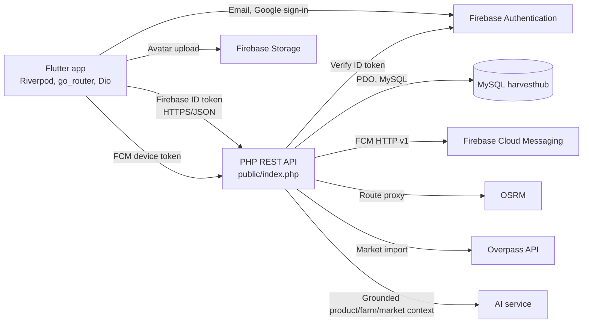

# HarvestHub

HarvestHub is a Flutter application that connects customers with local farmers. The project includes a mobile application, PHP REST API, MySQL, Firebase Authentication/Storage/Cloud Messaging, and map, routing, and AI services depending on configuration.

This README describes the existing source code. Some external services and the base MySQL schema need to be configured separately before the project can run fully.

Admin Account:
email: tcphana24039@cusc.ctu.edu.vn
pass:  phan1509@
## Features

- **Account and authentication:** login/register using email-password or Google, forgot password, profile completion, and role selection; the role is read from the backend.

- **Customer:** view products/farmers, find nearby markets, view and cancel orders that are still in an allowed status, review completed orders, manage wishlist, profile, follow farmers, and notifications.

- **Farmer:** submit a registration application; after being approved by an administrator, can manage products, orders, pickup slots, farm profile, reports, reviews, and notifications for followers.

- **Administrator:** manage accounts, customers, farmer profiles, products, categories, markets, orders, reports, contact messages, and audit logs.

- **Common utilities:** Vietnamese/English interface, light/dark mode, connection status, chatbot, OpenStreetMap maps, and OSRM directions.

## Architecture and Connections



**Flutter application** is located in `lib/`. `main.dart` initializes Firebase, EasyLocalization, and Riverpod; `app.dart` builds `MaterialApp.router`, theme, toast, offline banner, and chatbot. `core/router/app_router.dart` manages navigation and role checking on the UI side. Features are divided into common, customer, farmer, and admin; `data/api/` packages REST calls, while `data/repositories/` and providers manage state.

**PHP API** is located in `backend_php/`; `public/index.php` is the entry point, loads environment configuration, authenticates the Bearer token, connects to MySQL through PDO, and routes customer/farmer APIs. Admin APIs and reports are forwarded to `admin_api/`. The backend checks UID and role on every request; the Flutter route guard only improves the user experience and does not replace permission control on the server.

**Authentication flow:** Flutter receives a Firebase ID token and the Dio interceptor automatically attaches `Authorization: Bearer ...` to requests. PHP verifies the token through the Firebase Auth REST API, obtains the Firebase UID, and then looks up the `users` profile in MySQL. MySQL is the source of role data; the client cannot grant itself farmer/admin permissions through the payload.

**External services:** Firebase Storage stores avatars; product images are received by PHP and stored in `backend_php/public/uploads/products` (JPEG/PNG/WebP, maximum 5 MB). PHP calls FCM, OSRM, and the AI service from the server; the corresponding secrets are not placed inside the Flutter application.

## Database

### MySQL

The application database is named `harvesthub`. Business tables used include `users`, `farmers`, `products`, `categories`, `farmers_market`, orders/order details, `pickup_slots`, `reviews`, and `notifications`. Additional tables are created by migrations in `backend_php/database/`:

| Migration                          | Purpose                                                                                               |
| ---------------------------------- | ----------------------------------------------------------------------------------------------------- |
| `admin_features_schema.sql`        | Account/farmer lock status, farmer UID link, hidden products, English market names, and `audit_logs`. |
| `farmer_approval_single_admin.sql` | Farm address, unique farmer UID, and a maximum-one-admin constraint. Run after the admin migration.   |
| `farmer_followers.sql`             | Following relationship, FCM device token, and synchronization of `follower_count`.                    |
| `customer_wishlist.sql`            | Wishlist and unique key preventing duplicate reviews by order/product/customer.                       |
| `customer_shopping.sql`            | Server-side shopping cart table, pickup information, and a key preventing duplicate order requests.   |
| `password_reset.sql`               | OTP and rate limiting for the backend password-reset flow.                                            |

The above files are additional migrations, not a complete initialization schema. A base `harvesthub` schema with the required business tables/columns must exist before running them. Back up the database before migrating; migrations using `ALTER TABLE` generally should only be run once. For `farmer_approval_single_admin.sql`, before running it, make sure there are no duplicate farmer UIDs and there is currently no more than one admin.

The above files are additional migrations, not a complete initialization schema. The repository currently does not contain a complete SQL file for creating the base schema; the `harvesthub` schema must be obtained from the existing project environment/database before running the migrations. Back up the database before migrating; migrations using `ALTER TABLE` generally should only be run once. For `farmer_approval_single_admin.sql`, before running it, make sure there are no duplicate farmer UIDs and there is currently no more than one admin.

The files `nearby_markets_cantho.sql` and `fix_market_utf8.sql` are seed/data-fix files for markets depending on requirements; `sync_markets.php` imports additional data from Overpass.

### SQLite on the Device

`lib/data/local/schema.sql` creates the local database `harvesthub_offline.db`, including product/category/market/pickup-slot cache, `cart_items`, `outbox`, and `sync_meta`. This is device-side storage and does not replace MySQL as the centralized source of business data.

The code contains `SyncEngine` to pull product changes and push outbox operations. However, some methods called by the engine for product/cart/order/review deltas are currently not found implemented in `CustomerApi` and the PHP API. Therefore, offline synchronization of these operations should not be considered a complete flow until both APIs are connected and tested.

## Installation and Running

### Requirements

- Flutter SDK/Dart compatible with `pubspec.yaml` (Dart `>=3.3.0 <4.0.0`), Android Studio, or a device capable of running Flutter.

- PHP 8+, Composer, MySQL, and the required PHP extensions for PDO MySQL/cURL/Fileinfo.

- A Firebase project with Authentication enabled (Email/Password and Google if used), with the Android app registered; configure Storage/FCM if the corresponding features are used.

### 1. Configure Firebase for Flutter

`lib/main.dart` initializes `DefaultFirebaseOptions.currentPlatform`. Confirm that `lib/firebase_options.dart` and `android/app/google-services.json` belong to the same Firebase project. If using a different project configuration, run FlutterFire CLI to regenerate the options and place the correct Android configuration file; enable the required login providers in Firebase Console.

### 2. Configure MySQL and PHP API

Create the `harvesthub` database, load the project's base schema, then apply the migrations required for the intended features according to the table above. From PowerShell:

```powershell
Set-Location backend_php

Copy-Item .env.example .env

composer install
```

Fill in `DB_HOST`, `DB_PORT`, `DB_NAME`, `DB_USER`, `DB_PASSWORD`, and `FIREBASE_WEB_API_KEY` in `backend_php/.env`. Start the API from the `backend_php` directory:

```powershell
php -S 0.0.0.0:8080 -t public
```

Check `http://127.0.0.1:8080/api/health`. A real device must use the LAN address of the machine running PHP; Android Emulator normally uses `10.0.2.2` to access the host.

### 3. Configure Optional Services

- **Maps/directions:** set `OSRM_BASE_URL` to an OSRM instance accessible by the PHP server. Flutter calls the PHP proxy `/api/route` instead of calling OSRM directly. You can run `php bin/sync_markets.php` from the `backend_php` directory to import markets from Overpass.

- **Push notifications:** configure `FCM_PROJECT_ID` and `FCM_SERVICE_ACCOUNT_PATH`. Place the service-account JSON outside the repository and web root; enable the Firebase Cloud Messaging API. In-app notifications can work independently from push notifications.

- **Chatbot:** configure `AI_API_URL`, `AI_API_KEY`, and `AI_MODEL` in `.env`. The API reports a configuration error if the AI service is not ready.

- **Avatar:** add Firebase Storage Security Rules that restrict uploads to `avatars/{uid}/` for the correct authenticated UID; limit image size/format.

- **Farmer approval email:** configure SMTP in `.env` using an App Password; do not use a regular Gmail password.

Do not commit `.env`, service accounts, API keys, App Passwords, or private keys.

### 4. Run Flutter

From the root directory:

```powershell
flutter pub get

flutter run --dart-define=API_BASE_URL=http://10.0.2.2:8080
```

Replace `10.0.2.2` with `127.0.0.1` when running on the same machine where appropriate, the LAN address when running on a real device, or the HTTPS URL of the deployment environment. The current default is `http://localhost:8080`.

## Main Processing Flows

### Login and Authorization

1. The user logs in using Firebase Email/Password or Google.

2. The application calls `GET /api/auth/me`; PHP verifies the token and reads the role from MySQL.

3. A Firebase account without a MySQL profile is redirected to the account-completion step. `POST /api/auth/sync` creates an initial profile with the customer role; farmer/admin roles can only be set by trusted processes.

4. The router redirects the customer to `/home`, an approved farmer to `/farmer/dashboard`, and the admin to `/admin`. The API still checks the role independently on the server.

### Farmer Registration and Approval

1. The user authenticates, synchronizes the initial account, and then chooses to register as a farmer.

2. The application sends the farm profile together with GPS coordinates through `/api/farmer-applications`; the application is in `pending` status and the account does not yet have farmer permissions.

3. The admin reviews and approves/rejects the application. When approved, the backend updates the role and status; when rejected, the user can resubmit according to the existing process.

4. Only approved farmers can access farm-management APIs.

### Shopping, Orders, and Reviews

The customer loads categories/products from the PHP API, views farmer details, manages the wishlist, and views/cancels orders by UID; a review is only valid for a product belonging to a completed order. The cart/checkout interface, SQLite, and outbox have partial source code, but the order submission and offline cart synchronization flows are not complete: some `SyncEngine` methods/UI interfaces do not yet have implementations in `CustomerApi` or corresponding PHP endpoints. Checkout/offline orders should not be relied on before completion and integration testing. Farmers update orders/pickup slots; admins monitor orders in the administration page.

### Following and Notifications

Customers can follow/unfollow farmers. Farmers send notifications to followers; PHP stores notifications in MySQL and sends FCM to devices with registered tokens. Customers can read/mark notifications as read in the app. If FCM configuration is missing, in-app notification data is still stored but push notifications cannot be sent.

### Nearby Markets and Routing

The application requests location permission, obtains the device coordinates, and calls `/api/nearby-markets`. PHP queries markets within the requested radius from MySQL; Flutter displays the markets on OpenStreetMap. When a market is selected, the app calls `/api/route`; PHP forwards the request to OSRM and returns the route to the map.

### Administration

The admin logs in like a normal Firebase account. Every `/api/admin/*` and `/api/reports/*` request must contain a Bearer token; PHP checks the admin role in MySQL, processes the business logic, and records audit logs for supported operations. The initial admin role is granted through the CLI command in `backend_php/README.md`; do not create a public endpoint for granting roles.

## Testing

Run all Flutter tests:

```powershell
flutter test
```

The backend has chatbot service tests in `backend_php/tests/`. Run them after installing Composer dependencies:

```powershell
Set-Location backend_php

php tests/chatbot_service_test.php
```

Flows requiring Firebase, MySQL, FCM, OSRM, or AI must be tested additionally with the corresponding service configuration; local tests do not automatically create these configurations.

## Folder Structure

```text
lib/

  core/                  Auth, router, network, theme, notifications, providers

  data/                  REST API, repository, local SQLite, outbox/sync

  features/              common, customer, farmer, admin

  l10n/                  Vietnamese and English translations

  models/                Data models

  shared_widgets/        Shared widgets

  main.dart, app.dart    Application initialization and setup

backend_php/

  public/                HTTP entry point and uploads

  admin_api/             Administration and reporting APIs

  config/                Database/CORS configuration

  database/              SQL migrations and seeds

  src/                   Shared PHP services

  tests/                 Backend tests

  bin/                   Data synchronization tools

test/                    Flutter tests
```

# HarvestHub Mobile — Person 1 (Shared Infrastructure, Auth, Static Pages)

Implemented according to the "Person 1" specification: token & theme, i18n, router, shared widget library, and 6 screens (1.1 → 1.6).

## Installation

```bash
flutter pub get

flutterfire configure   # generate lib/firebase_options.dart, then uncomment
                         # the import + options lines in lib/main.dart

flutter run --dart-define=API_BASE_URL=https://your-api.example.com
```

## Map and Nearby Markets

The `/nearby-markets` page obtains the GPS location, queries active markets in

MySQL, displays them on an OpenStreetMap background, and draws OSRM routes directly on the map

when a market is selected. Android has already declared location and Internet permissions.

To run this flow, you need to:

1. Run the PHP/MySQL backend according to the instructions in `backend_php/README.md`.

2. (Optional) Run `php bin/sync_markets.php` in the `backend_php` directory to

   import additional data from Overpass.

3. Configure `OSRM_BASE_URL` in `backend_php/.env` to an OSRM instance that can

   be accessed from the PHP server.

4. Configure Flutter's `API_BASE_URL` to the PHP API; do not call OSRM directly

   from the application.

## Farmer

Approved farmers are redirected to `/farmer/dashboard`; other

accounts cannot access this area. The product, order, pickup-slot, report,

review, notification, and farm-profile screens use the existing Firebase

ID token; the backend identifies the farmer from the logged-in UID and only allows operations

on that farmer's data. The product API supports JPEG/PNG/WebP images up to 5 MB,

stored in `backend_php/public/uploads/products`.

Customers can follow/unfollow farmers at `/customer/farmers` and view

notifications in the app at `/customer/notifications`. Farmers can view the follower list

and send notifications to this group in the Community tab. Notifications are stored in

the `notifications` table and displayed in the app; the backend also sends FCM push

notifications to registered devices. To enable FCM push, create a separate service account

with Firebase Cloud Messaging Admin permissions, store the JSON file outside the web root/repository, and set

`FCM_PROJECT_ID` and `FCM_SERVICE_ACCOUNT_PATH` in `backend_php/.env`.

Do not send/commit private keys. If FCM is not configured, in-app notifications are still

stored and the UI clearly displays the push status.

Before using the feature, run `database/farmer_followers.sql` in phpMyAdmin.

The migration creates the farmer-customer relationship table and FCM token table, foreign-key constraints,

and synchronizes `farmers.follower_count` based on following data.

## Customer — Account and After-Sales

The routes `/orders`, `/orders/:id`, `/wishlist`, `/following`, `/farmers/:id`,

`/account/profile`, `/notifications`, and `/shop` use the real PHP API and are

restricted by the customer role. To enable the wishlist, back up the database first and then run

`backend_php/database/customer_wishlist.sql` once on `harvesthub`.

The migration creates the wishlist table and a constraint preventing duplicate reviews by order/product/UID;

if duplicate reviews already exist, they must be handled before adding the unique index.

Order, farmer, inventory, product, and notification information is retrieved from MySQL. Profile

images are uploaded to Firebase Storage under `avatars/{uid}/`; Storage Security

Rules must only allow the logged-in UID to write to their own directory. The chatbot requires

AI service configuration in `backend_php/.env`; when it is not configured, the API returns an error

instead of generating fake answers/data.

Minimum Firebase Storage Rules for avatars (add them to the existing rules while keeping

the project's other rules):

```text
match /avatars/{uid}/{fileName} {

  allow read: if true;

  allow write: if request.auth != null

    && request.auth.uid == uid

    && request.resource.size < 5 * 1024 * 1024

    && request.resource.contentType.matches('image/(jpeg|png|webp)');

}
```

Following, wishlist, and chatbot require backend support. The parts depending on Person 2's module —

cart/add-to-cart, offline order entry, and review outbox — are not yet present in

the workspace and should be clearly indicated in the UI; there is no enqueue or backend synchronization yet.

FCM configuration is not required again for these screens; customer push notifications still use the

FCM setup described above.

## Created Structure

```text
lib/

  core/

    theme/        app_colors.dart, app_theme.dart, app_motion.dart

    router/       app_router.dart (go_router, shared route transitions)

    network/      dio_client.dart (Dio + interceptor attaching Firebase ID token)

    auth/         auth_repository.dart (email/password, Google, /api/auth/sync)

    providers/    app_providers.dart (theme mode, connectivity)

  l10n/           vi.json, en.json (common.* keys)

  shared_widgets/ 16 shared widgets according to section B of the spec

  features/common/

    landing_page.dart          1.1  route /

    login_page.dart            1.2  route /auth (contains both login/register forms)

    register_page.dart         1.2  RegisterForm — registration form content

    forgot_password_page.dart  1.3  route /auth/forgot-password

    about_page.dart            1.4  route /about

    contact_page.dart          1.5  route /contact

    faq_page.dart              1.6  route /faq

  app.dart          MaterialApp.router, mount ToastOverlay + OfflineBanner

  main.dart         initialize Firebase + EasyLocalization + ProviderScope
```

## Notable Technical Decisions

- **`/auth` is a single route** for both login and registration, switching

  using `AnimatedSwitcher` crossfade 150ms in `login_page.dart`, as described in

  section 1.2 (not separated into two individual routes).

- **Firebase errors are mapped to i18n keys** (`_mapFirebaseError` in

  `auth_repository.dart`) before being displayed — the original error codes

  (`wrong-password`, `email-already-in-use`, etc.) are never exposed

  to users.

- **Forgot password always returns the same message** regardless of whether the email exists,

  including when Firebase returns `user-not-found` (to prevent email enumeration).

- **ToastOverlay and OfflineBanner are mounted only once** in `app.dart` (inside

  the `builder:` of `MaterialApp.router`), rather than being repeated on every screen.

- All animations use the exact tokens in `app_motion.dart` — no

  hard-coded `Duration`/`Curve` values in feature code.

## Still Needs Integration (Belongs to Other People / Later Steps)

- `lib/firebase_options.dart` (generated using `flutterfire configure`, not yet available

  because it depends on the actual Firebase project).
